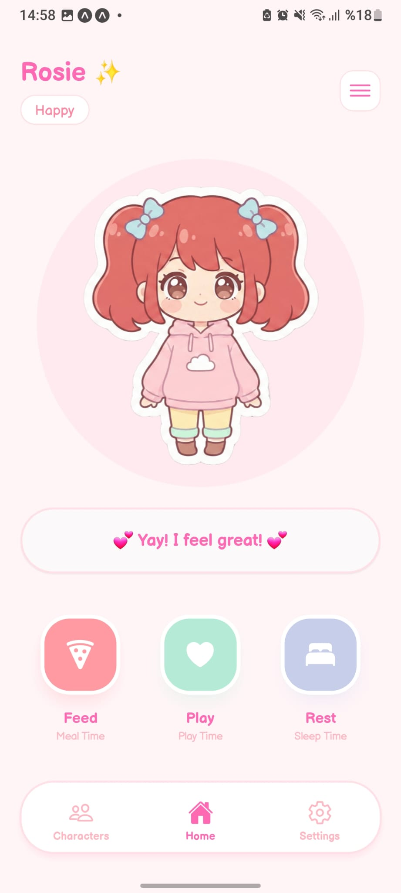
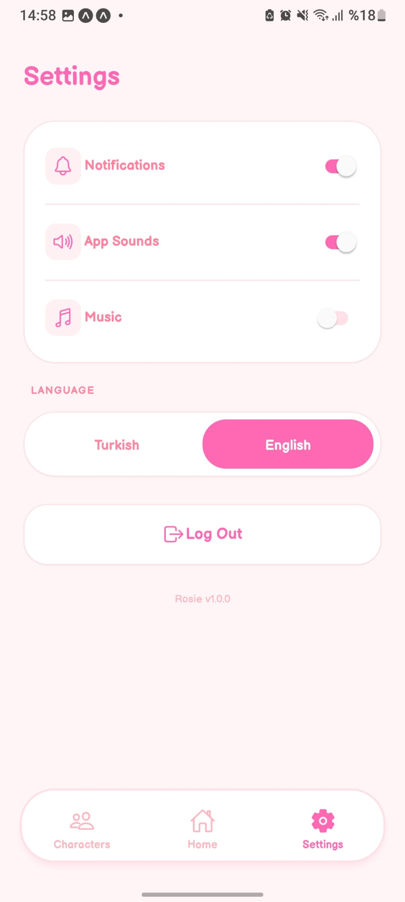
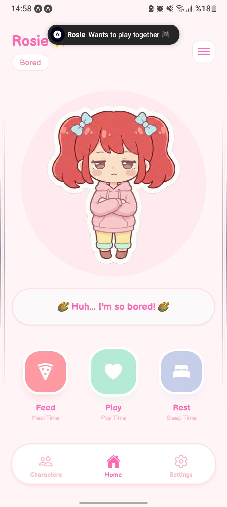

# Rosie ✨ - Your Kawaii Virtual Pet

Rosie is beautifully designed virtual pet application built with **React Native** and **Expo**. With its "Kawaii" aesthetic, smooth animations, and interactive features, Rosie provides a delightful companion experience right on your mobile device.

## 📸 Screenshots

<div align="center">
  
  
  
  
</div>

## ✨ Features

- **Dynamic Pet States**: Rosie's mood changes over time (Happy, Hungry, Bored, Tired).
- **Interactive Actions**: Feed, play, and let Rosie rest to keep her happy!
- **Voice Lines & SFX**: Custom voice lines based on Rosie's mood and satisfying sound effects for interactions.
- **Global Music Player**: Soothing background music that respects your settings and persists across screens.
- **Multi-Language Support**: Fully localized in **Turkish** and **English**.
- **Push Notifications**: Stay updated on Rosie's needs even when the app is closed.
- **Developer Menu**: Easy-to-use testing menu to simulate different pet states instantly.
- **Premium UI/UX**: Designed with **Balsamiq Sans** typography, floating navigation, and a pastel color palette.

## 🚀 Tech Stack

- **Framework**: [Expo](https://expo.dev/) (SDK 54)
- **Navigation**: [Expo Router](https://docs.expo.dev/router/introduction/) (File-based routing)
- **Styling**: [NativeWind](https://www.nativewind.dev/) (Tailwind CSS for React Native)
- **Backend**: [Firebase](https://firebase.google.com/) (Authentication & Firestore)
- **Database**: Firestore (Real-time pet status synchronization)
- **Audio**: [Expo AV](https://docs.expo.dev/versions/latest/sdk/av/)
- **Localization**: [i18next](https://www.i18next.com/) & `react-i18next`
- **Fonts**: Balsamiq Sans via Google Fonts

## 🛠️ Installation & Setup

1. **Clone the repository:**
   ```bash
   git clone https://github.com/trkturker/withRosie.git
   cd withRosie
   ```

2. **Install dependencies:**
   ```bash
   npm install
   ```

3. **Start the development server:**
   ```bash
   npm run start # (with expo)
   # or
   npx expo run:android
   ```

## 📱 Project Structure

- `app/`: Main application screens and layouts (Expo Router).
- `assets/`: Images, animations, sound effects, and voice lines.
- `components/`: Reusable UI components (ActionButtons, HamburgerTestMenu, etc.).
- `context/`: Application state management (Auth and Settings).
- `i18n/`: Localization files and configuration.
- `lib/`: Firebase setup, notifications, and utility functions.

## 📄 License

This project is licensed under the MIT License.

---

